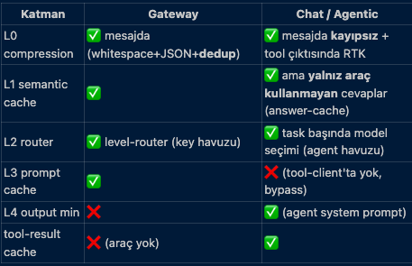

# Cost Layers — Gateway ve Agentic

AgenticBEAR'da her LLM çağrısı bir dizi **cost layer**'dan geçer. Aynı katmanlar
hem **Gateway** (dış müşteri app'lerin OpenAI-uyumlu endpoint'ten geçirdiği çağrılar)
hem de **Agentic** (proje chat'i ve agent run'ları) için çalışır — çünkü her iki path
de aynı `costMiddleware.complete()` fonksiyonuna gider
([server/src/cost/middleware.ts](../../packages/server/src/cost/middleware.ts)).



## Kısa özet

| Katman | Nereden tasarruf eder | Boyut | Etki |
|---|---|---|---|
| **L0** — Context Compression | girdi token *sayısı* | deterministic | %30–99 girdi token |
| **L1** — Semantic Cache | çağrı tamamen | embedding + judge | tekrarlı trafikte %100 |
| **L2** — Level Router | token *fiyatı* | küçük classifier | ~%69 canlı gözlenen |
| **L3** — Prompt Cache | sabit prefix token fiyatı | provider-side | %10–50 girdi fiyatı |
| **L4** — Output Minimization | çıktı token *sayısı* | system directive | ~%80 kısalma referans |

Her katman *bir öncekinin ürettiği çıktı üstünden* çalışır. Yani bir çağrı L1'den
cache hit ile dönmüşse L2/L3/L4 hiç çalışmaz. Katmanların sırası kritik değil ama
şu sıralamayla en verimli çünkü ucuz olanlar erken elenir:

```
L0 (girdiyi kısalt) → L1 (cache?) → L2 (ucuz modele yönlendir) → L3 (prefix cache) → L4 (çıktıyı kısalt)
```

---

## Her katmanın detayı

### L0 — Context Compression
[server/src/cost/layers/compression.ts](../../packages/server/src/cost/layers/compression.ts)

Gönderdiğin metni modele ulaşmadan önce küçültür:
- Fazla boşluk silinir, JSON minify edilir
- Tekrar eden satırlar `⟪×150⟫` gibi işaretlerle özetlenir
- Büyük tool çıktısı `head+tail` kırpması yapılır (ortadaki elenir)

**Örnek:** 150 tekrar log satırı → ~1313 token yerine ~15 token (canlı demo).
**Sonuç:** çağrının kendisi aynı, ama girdi tarafı %30–99 daha küçük → provider'a
daha az input token gider → daha az input token faturalanır.

### L1 — Semantic Cache
[server/src/cost/layers/semantic-cache.ts](../../packages/server/src/cost/layers/semantic-cache.ts)

Prompt'u embedding'e çevirip Qdrant'ta benzerini arar:
- **Similarity ≥ 0.90** → doğrudan hit, kayıttaki cevap döner
- **0.80 – 0.90 arası** → küçük bir classifier ("bu iki soru aynı intent'i mi taşıyor?")
  yes derse hit sayılır, judge'un maliyeti bir kaç tenth-of-a-cent
- **< 0.80** → miss, normal akışa devam

**Örnek:** "Valkey nedir?" ilk çağrı tam fiyat. İkinci çağrı ("Valkey'i anlat"
paraphrase'i dahil) hit → o çağrının hem input hem output token'ı **0**.
**Sonuç:** tekrarlı/benzer trafikte çağrı başına %100 tasarruf.

### L2 — Level Router
[server/src/cost/layers/router.ts](../../packages/server/src/cost/layers/router.ts) · [model-select.ts](../../packages/server/src/cost/layers/model-select.ts)

Küçük/ucuz bir classifier işin karmaşıklığını **1–10** puanlar. Sonra sen modellere
verdiğin "capability level" değerine göre, o karmaşıklığı karşılayabilecek en ucuz
modeli seçer. **İstenen model = tavan; router asla yukarı çıkmaz**, sadece aşağı iner.

**Örnek:** İstek `claude-opus-4` (pahalı), soru "2+2 kaç?" (complexity 1). Router
`haiku` veya nano seviyesindeki bir modele yönlendirir. Token sayıları ~aynı ama
token birim fiyatı çok daha düşük.
**Sonuç:** "her şeyi güçlü modele soruyorum" senaryosunda basit sorular ucuz
modele kayar (canlı ~%69).

### L3 — Prompt Cache
[server/src/cost/layers/prompt-cache.ts](../../packages/server/src/cost/layers/prompt-cache.ts)

Sabit, uzun system prefix'ini provider tarafında cache'ler:
- **Anthropic:** `cache_control: {"type":"ephemeral"}` marker'ı — cache'lenmiş
  token'lar tam fiyatın **~%10**'una geliyor
- **OpenAI / Azure:** otomatik `cached_tokens` — tam fiyatın **~%50**'sine geliyor

Provider'ın response'undaki `cached_tokens` alanı okunur ve tasarruf bizim tarafımızda
kredilendirilir (Gateway'de x-agb-* header'larına da yansır).

**Örnek:** 2000 token'lık system prompt her turda gönderiliyor. İlk çağrıda "cache
oluşturma" bedeli var, sonraki çağrılardan itibaren o 2000 token %10/%50 fiyata →
çağrı başına ~%47 (canlı ölçüm).
**Sonuç:** girdi token *sayısı* aynı kalır ama o token'ların *birim fiyatı* düşer.

### L4 — Output Minimization
[server/src/cost/layers/output-minimize.ts](../../packages/server/src/cost/layers/output-minimize.ts)

System prompt'a küçük bir direktif ekler: "tembel kıdemli dev tavrı — gereksiz
kod yazma, kısa ol, over-engineer etme". Model daha az üretir → daha az output
token faturalanır.

Bu tasarruf **sayaç tabanlı ölçülemez** çünkü counterfactual: "eğer bu direktifi
eklemeseydim ne kadar yazacaktı?" bilinmez. Referans benchmark: 400 satırlık
over-engineer çözüm → 23 satır (%80 civarı).
**Sonuç:** L0–L3 girdi/fiyat tarafını, L4 çıktı tarafını kısar.

---

## Gateway path — dış müşteri app'leri

Dış müşteri app'in `.env`:
```env
OPENAI_BASE_URL=http://your-agenticbear/v1
OPENAI_API_KEY=agb_live_...
```

`POST /v1/chat/completions` isteği geldiğinde:

```
[HTTP request]
       ↓
[requireGatewayKey]         → API key doğrulama, rate limit, aylık bütçe
       ↓
[redactEgress]              → DLP: secret'ları [REDACTED:*] ile değiştir
       ↓
[parseModelRef]             → 'gemini/deepseek-v4-pro' → { providerId, model }
       ↓
[costMiddleware.complete]   → L0 → L1 → L2 → L3 → L4
       ↓
[provider'a HTTP çağrı]     → Anthropic / OpenAI / custom
       ↓
[gatewayUsageRepo.record]   → key_id + model + cost + cache_hit
       ↓
[HTTP response]             → x-agb-cost-usd, x-agb-cache-hit header'lar
```

**Gateway'e özel ekstralar:**
- **Per-key model scope**: bir API key sadece izin verilen modellere çağrı yapabilir
  (custom provider için `<slug>/<model>` veya `owner:<slug>` wildcard)
- **Per-key rate limit + aylık USD bütçe**: aşıldığında 429
- **Group token quota**: aynı group'a bağlı tüm key'lerin toplam token tüketimi
  kotayla sınırlanır
- **DLP disabled models**: bazı sandbox modellerini DLP'den muaf tutabilirsin

Cost sonuçlarını görmek için: **Gateway → Usage** panelinde per-key + per-model
breakdown, cache hit rate gauge, over-time chart, saved-usd delta.

---

## Agentic path — chat ve agent run'ları

Kullanıcı proje chat'ine bir mesaj yazdığında:

```
[user prompt]
       ↓
[projeye ait system prompt + agent memory + docs]  → context inşa
       ↓
[redactEgress]                                     → aynı DLP guard
       ↓
[costMiddleware.complete]                          → aynı 5 katman
       ↓
[tool loop: read_file / grep_codebase / vs.]       → her tur costMiddleware'den geçer
       ↓
[activity log + run_steps yazımı]                  → per-step cost attribution
```

**Agentic'e özel ekstralar:**

- **Tool-result cache**
  [agent-tools.ts](../../packages/server/src/services/agent-tools.ts)
  Aynı `read_file` / `list_files` / `grep_codebase` / `find_references` tekrar
  çağrılırsa diskten okunmaz, sonuç cache'ten döner. TTL var, workspace'te bir
  yazma olursa o workspace'in tüm cache'i invalidate olur. **LLM'e giden gereksiz
  round-trip'i keser** — L1 semantic cache'in bir alt seviyesi gibi.

- **Agentic answer cache**
  Chat'te tool kullanmayan saf-cevap turn'leri L1 semantic cache'e yazılır.
  Kullanıcı benzer soruyu tekrar sorarsa çağrı bedava (canlı ~%50).

- **Grep / find_references disiplini** (yeni)
  Agent'ın orchestrator ve refactor spesyalistlerine `grep_codebase` ile
  `find_references` tool'ları verildi. `list_files` + `read_file` döngüsü yerine
  bunlar kullanıldığında **bir kullanıcı turundaki tool call sayısı 8-15'ten 3-5'e**
  düşer → gateway'e çıkan LLM request sayısı aynı oranda azalır (aynı işi %20-30
  daha ucuz yapar).

- **Per-run attribution**
  Her `run_steps` satırı hangi agent'ın hangi turnünde hangi model + hangi cost +
  cache_hit + router_tier — hepsi kaydedilir. Bu **Project → Monitor** sayfasında:
  by-agent bar chart, savings-by-layer breakdown, cache gauge, router-tier pie
  olarak görünür.

---

## Aynı katmanlar — farklı path'lerdeki gözlemlenebilirlik

| Katman | Gateway'de | Agentic'te |
|---|---|---|
| **L0** compression | `x-agb-*` header (dolaylı) | `compressionSavedTokens` her run_step'te |
| **L1** semantic cache | `x-agb-cache-hit: true` | `cache_hit=1` run_step + agentic answer cache |
| **L2** router | `x-agb-served-model` (istenen ≠ servis edilen) | `router_tier` run_step + Router tiers chart |
| **L3** prompt cache | `x-agb-cost-usd` içine implicit | `cache_read_tokens` / `cache_creation_tokens` mix |
| **L4** output minimization | ölçülemez (counterfactual) | ölçülemez |

## Dashboards

Cost katmanları etkisini **iki farklı dashboard**'da görürsün:

1. **Gateway → Usage**
   - Requests, Tokens, Spend, Saved, Cache hits KPI'ları
   - Over-time bar chart (günlük)
   - By-model / by-key breakdown
   - Cache efficiency gauge

2. **Project → Monitor** ve **Settings → Usage** (org-wide)
   - Aynı KPI'lar + `Savings by layer` breakdown (L0/L1/L2/L3 ayrı çubuklar)
   - `Router tiers` dağılımı (TRIVIAL / SIMPLE / COMPLEX / NONE)
   - `Token mix` (input / output / cache_read / cache_creation)
   - By-project + by-agent + by-model breakdown

## Konfigürasyon

Katmanları global env değişkenleriyle açıp kapatabilirsin
([server/src/cost/config.ts](../../packages/server/src/cost/config.ts)):

```
COST_LAYER_COMPRESSION=true|false      # L0
COST_LAYER_SEMANTIC_CACHE=true|false   # L1
COST_LAYER_ROUTER=true|false           # L2
COST_LAYER_PROMPT_CACHE=true|false     # L3
COST_LAYER_OUTPUT_MIN=true|false       # L4
```

Deneyler yaparken bunları kapatıp aynı prompt'u iki kere gönder — Gateway
dashboard'unda baseline vs actual delta'yı göreceksin.

## Maliyet nasıl ölçülür — TÜM sağlayıcılar için

Unified client her sağlayıcıdan **gerçek `usage` token'larını** döner; fiyat model başına
çözülür ([provider-registry.modelPricing](../../packages/server/src/llm/provider-registry.ts) →
built-in `CLAUDE_MODELS` veya custom sağlayıcının model fiyatı). [cost/pricing.ts](../../packages/server/src/cost/pricing.ts)
cache read/write çarpanlarını uygular. DeepSeek / Azure / lokal harcaması da gerçek rakam
olarak görünür — 0 değil.

- **`actualCostUsd`** = servis edilen modelin maliyeti (router/cache sonrası) + router classifier bedeli.
- **`baselineCostUsd`** = aynı çağrı ana modelde, cache'siz, tam prefix'le ne tutardı.
- **savings** = baseline − actual.

## Kod nerede?

- **Ortak middleware:** [`packages/server/src/cost/middleware.ts`](../../packages/server/src/cost/middleware.ts)
- **Layer implementasyonları:** [`packages/server/src/cost/layers/*.ts`](../../packages/server/src/cost/layers/)
- **Gateway giriş noktası:** [`packages/server/src/routes/gateway.ts`](../../packages/server/src/routes/gateway.ts)
- **Agentic giriş noktası:** [`packages/server/src/services/agent-loop.service.ts`](../../packages/server/src/services/agent-loop.service.ts)
- **Tool-result cache:** [`packages/server/src/services/agent-tools.ts`](../../packages/server/src/services/agent-tools.ts)
- **Usage attribution (yazma):** [`packages/server/src/db/repositories/gateway-usage.repo.ts`](../../packages/server/src/db/repositories/gateway-usage.repo.ts) (gateway), `run_steps` (agentic)
- **Analytics (okuma):** [`packages/server/src/routes/analytics.ts`](../../packages/server/src/routes/analytics.ts)
